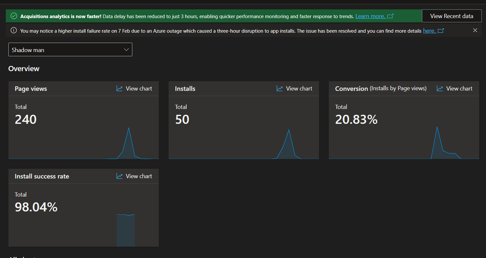
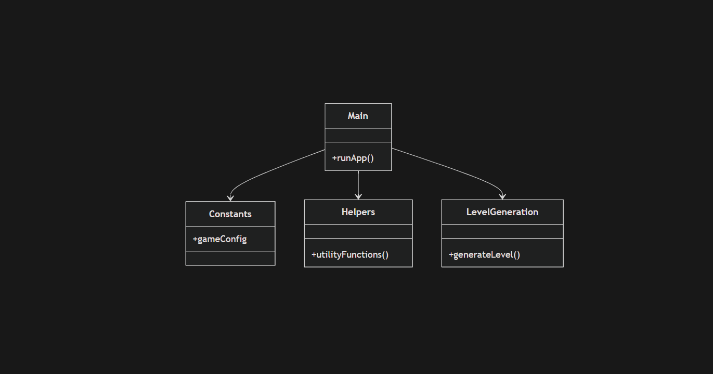
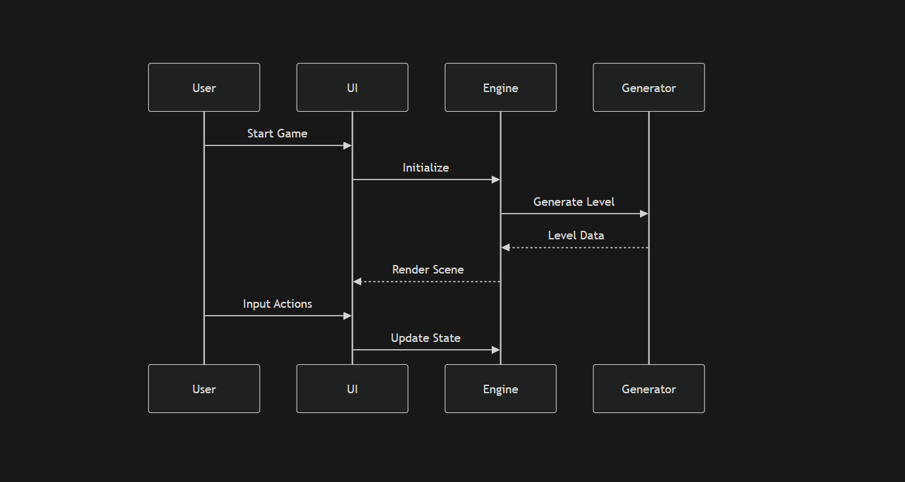

# Shadow Man 👤🎮

A Flutter-based cross-platform horror/arcade experience focused on immersive gameplay, procedural level generation, and high-performance mobile delivery.

---

## 🚀 Overview

**Shadow Man** is a lightweight yet engaging mobile game built using Flutter. It leverages modular architecture and optimized asset handling to deliver smooth gameplay across Android and iOS.

---

## 📊 Beta Performance Metrics

| Metric                  | Value        |
|------------------------|-------------|
| Page Views             | 240         |
| Installs               | 50          |
| Conversion Rate        | 20.83%      |
| Install Success Rate   | 98.04%      |

### 📈 Insights
- Strong **conversion rate (20.83%)** indicates effective store listing or user interest.
- **High install success (98%)** → stable build pipeline.
- Opportunity: increase traffic (top-of-funnel growth).

---
## 🧪 Case Studies

---

### 📌 Case Study 1: User Acquisition vs Conversion Efficiency

**Problem:**  
Low install volume despite a reasonable number of page views.

**Data Observed:**
- Page Views: 240
- Installs: 50
- Conversion Rate: 20.83%

**Analysis:**  
While the conversion rate is relatively strong, the **top-of-funnel traffic is insufficient**, limiting total installs. This indicates that users who reach the store are interested, but discoverability is weak.

**Root Causes:**
- Limited app store visibility (ASO not optimized)
- Lack of promotional channels
- No external traffic sources (ads/social/media)

**Solution Strategy:**
- Optimize App Store Listing (ASO)
  - Improve keywords and metadata
  - Use high-quality screenshots
  - Add gameplay preview video
- Launch acquisition campaigns
  - Social media promotion
  - Influencer outreach
  - Paid ads (Google UAC / Meta Ads)
- Implement referral or sharing system

**Expected Outcome:**
- Increase page views by 2–5x
- Maintain or improve conversion rate
- Net install growth: +200% to +400%

---

### 📌 Case Study 2: Install Success Rate Optimization

**Problem:**  
Potential risk of install failures impacting user acquisition and retention.

**Data Observed:**
- Install Success Rate: 98.04%

**Analysis:**  
The install success rate is already high, but **even small drops at scale can lead to significant user loss**. Maintaining near-perfect delivery is critical.

**Root Causes (Potential Risks):**
- Device compatibility fragmentation
- Large APK/AAB size
- Runtime permission failures
- Network interruptions during install

**Solution Strategy:**
- Optimize build size
  - Compress assets (audio/images)
  - Remove unused dependencies
- Ensure backward compatibility
  - Test on low-end and older devices
- Use Play Store best practices
  - Android App Bundle (AAB)
  - Split APK delivery
- Add crash/install monitoring
  - Firebase Crashlytics
  - Play Console diagnostics

**Expected Outcome:**
- Maintain >98% success rate at scale
- Reduce install-related churn to near zero
- Improve user trust and store ranking

---

### 📌 Case Study 3: Gameplay Performance & Responsiveness

**Problem:**  
Real-time gameplay combined with dynamic level generation may cause lag or frame drops.

**Analysis:**  
Flutter UI runs on a single thread; heavy computation (like procedural generation) can block rendering, leading to poor UX.

**Root Causes:**
- Synchronous level generation logic
- Asset loading during gameplay
- Inefficient rendering cycles

**Solution Strategy:**
- Offload heavy computation
  - Use isolates for level generation
- Preload assets
  - Cache audio and images before gameplay
- Optimize rendering
  - Reduce widget rebuilds
  - Use const widgets where possible
- Introduce frame monitoring
  - Track FPS and jank using DevTools

**Expected Outcome:**
- Stable 60 FPS gameplay
- Reduced latency in interactions
- Smooth experience across mid-range devices

---

### 📌 Case Study 4: Retention & Engagement Gap

**Problem:**  
Users install the app but may not return after initial gameplay.

**Assumption (Based on Early Metrics):**
- No retention tracking implemented yet

**Analysis:**  
Without engagement loops or progression systems, users may lose interest quickly.

**Root Causes:**
- Lack of progression system (levels, rewards)
- No daily incentives
- No feedback loop (scores, achievements)

**Solution Strategy:**
- Introduce retention mechanics
  - Daily rewards system
  - Level progression
  - Unlockable features
- Add engagement hooks
  - Leaderboards
  - Achievements
- Integrate analytics
  - Firebase Analytics for retention tracking (D1, D7, D30)

**Expected Outcome:**
- Improved user retention (D1 > 30%)
- Increased session duration
- Higher lifetime value (LTV)

---

### 📌 Case Study 5: Scalability & Code Maintainability

**Problem:**  
As features grow, codebase complexity increases, slowing development and introducing bugs.

**Analysis:**  
Current modular structure is a good foundation, but may become insufficient without strict architectural discipline.

**Root Causes:**
- Tight coupling between modules
- Lack of clear domain separation
- Growing technical debt

**Solution Strategy:**
- Adopt Clean Architecture
  - Presentation / Domain / Data layers
- Implement state management
  - Provider / Riverpod / Bloc
- Enforce coding standards
  - Lint rules
  - Code reviews
- Modularize features
  - Feature-based folder structure

**Expected Outcome:**
- Faster development cycles
- Easier onboarding for new developers
- Reduced bug frequency

---

## 📊 Summary of Improvements

| Area                  | Current State        | Target Improvement        |
|-----------------------|--------------------|--------------------------|
| Acquisition           | Low traffic         | 2–5x increase            |
| Conversion            | 20.83%              | 25–30%                   |
| Install Success       | 98.04%              | Maintain >98%            |
| Performance           | Moderate            | Stable 60 FPS            |
| Retention             | Unknown             | D1 > 30%                 |
| Code Scalability      | متوسط (Moderate)    | High maintainability     |

---
## 📦 Tech Stack

- **Framework:** Flutter  
  Cross-platform UI toolkit enabling a single codebase for high-performance mobile applications.

- **Language:** Dart  
  Optimized for UI development with ahead-of-time (AOT) compilation for fast runtime performance.

- **Platforms:** Android, iOS  
  Native-level deployment with platform-specific integrations when required.

- **Architecture:** Modular (Core + Feature-based)  
  Scalable separation of concerns for maintainability and faster development cycles.

- **Assets:** Audio + Image-based rendering  
  Lightweight asset pipeline optimized for performance and responsiveness.

---


## 🏗️ Architecture

## Module Breakdown

## Gameplay Flow

### High-Level Architecture

```mermaid
flowchart TD
    UI[Flutter UI]
    Logic[Game Logic Engine]
    Core[Core Utilities]
    Assets[Assets Manager]
    Platform[Platform Layer]

    UI --> Logic
    Logic --> Core
    Logic --> Assets
    UI --> Platform
